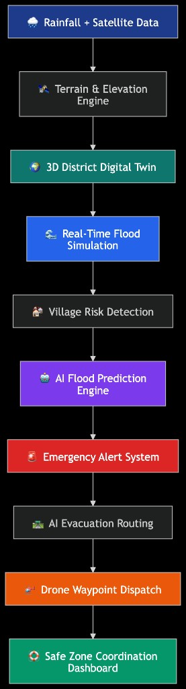
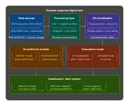
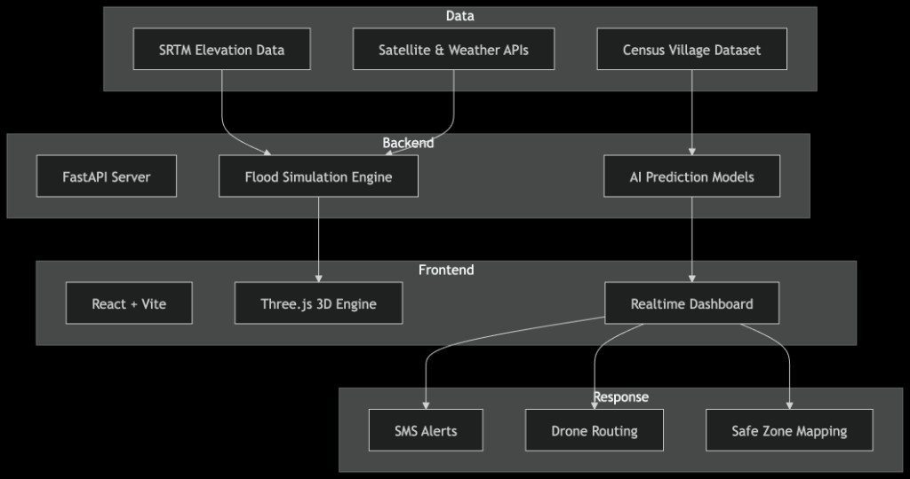
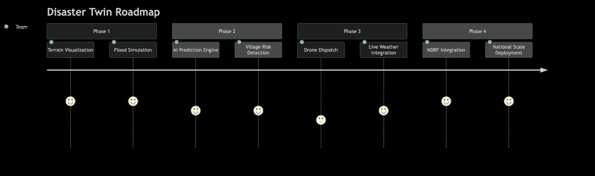
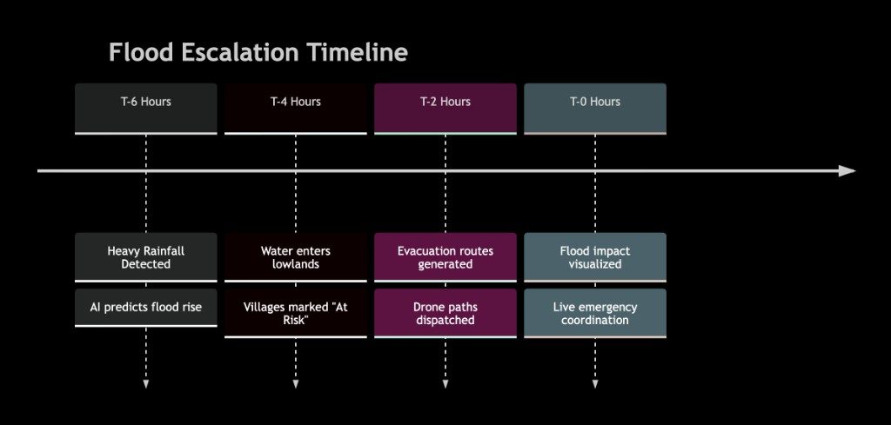

# 🌊 FloodGuard AI

### AI-Powered Disaster Response Digital Twin

FloodGuard AI is a real-time 3D disaster simulation platform designed to predict flood spread, identify vulnerable villages, generate evacuation routes, and assist emergency response teams using AI and geospatial intelligence.

---

## 🚨 Problem

India loses over ₹1.5 lakh crore annually due to floods, cyclones, and natural disasters.

Emergency response is often delayed because:
- Flood spread visibility is limited
- Evacuation planning is manual
- Villages lack early warnings
- Terrain intelligence is fragmented

FloodGuard AI aims to solve this using real-time digital twin technology.

---

## 🌍 Core Features

- 🌊 Real-time flood spread simulation
- 🛰 Satellite terrain visualization
- 🏘 Village-level flood risk analysis
- 🤖 AI-based flood prediction
- 🛣 Intelligent evacuation routing
- 🚁 Drone waypoint generation
- 📡 Emergency coordination dashboard

---

## 🧠 Tech Stack

- React + Vite
- Three.js
- FastAPI
- Python
- GIS & Elevation Data
- AI/ML Prediction Models

---

## 🧩 System Overview

This end-to-end flow powers the FloodGuard AI digital twin:



---

## ⚙️ Simulation Pipeline

From terrain generation to actionable response:


---

## 🏗 Flood Simulation Architecture

How simulation layers, triggers, and response outputs connect:



---

## 🛠 Full Stack Architecture

Data-to-response architecture across frontend, backend, and operations:



---

## 🗺 Product Roadmap

Milestone-wise plan from prototype to national scale:



---

## ⏱ Flood Escalation Timeline

Decision intelligence by time-to-impact:



---

## 📦 Initial Repository Structure

```text
FloodGuard-AI/
├── frontend/
│   └── src/
│       ├── assets/
│       ├── components/
│       ├── hooks/
│       ├── scenes/
│       ├── services/
│       └── styles/
├── backend/
│   ├── app/
│   │   ├── api/
│   │   ├── core/
│   │   ├── models/
│   │   ├── schemas/
│   │   ├── services/
│   │   └── utils/
│   └── tests/
├── data/
│   ├── external/
│   ├── processed/
│   └── raw/
├── docs/
│   └── infographics/
├── infra/
├── ml/
│   ├── models/
│   ├── notebooks/
│   └── training/
└── scripts/
```

---

## 🎯 Vision

FloodGuard AI turns disaster management from reactive response to proactive, data-driven action.  
The goal is not just simulation, but saving lives through early warning, better planning, and coordinated field execution.
